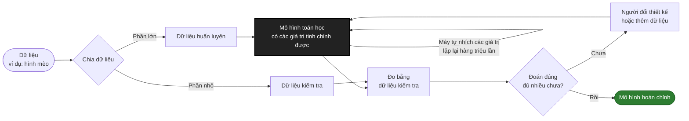

## Lời mở đầu

Mình đã phân vân không biết có nên viết bài này không, vì thông tin về trí tuệ nhân tạo (AI, viết tắt của Artificial Intelligence) ngoài kia đã nhiều vô kể. Nhưng mình tin rằng, dù công nghệ thay đổi nhanh đến đâu, những hiểu biết cốt lõi vẫn giữ nguyên giá trị, và chúng nên được giải thích một cách dễ hiểu nhất.

Bài này dành cho ông bà, bố mẹ, và bất kỳ ai dùng AI hằng ngày mà chưa ai giải thích cho họ một cách đơn giản. Đọc xong, bạn sẽ hiểu vì sao ChatGPT có thể trả lời rất tự tin nhưng vẫn sai, và nên làm gì khi đó.

Trước khi bắt đầu với AI, thì chúng ta sẽ tìm hiểu sơ về một khái niệm được dùng phổ biến trong khoa học và kỹ thuật: Hộp đen (black box).

{: style="display:block; margin:0 auto;"}

<em>Đây là cách AI Claude vẽ chính mình khi được yêu cầu "hãy tự họa bản thân"</em>

## Hộp đen - black box

Hộp đen ở đây không phải là cái hộp đen trên máy bay mà mọi người hay nói. Cái hộp đen đó thậm chí không phải là màu đen mà là màu cam, vì khi có chuyện không may xảy ra, cái hộp ấy sẽ thật nổi bật để dễ được phát hiện.

{: style="display:block; margin:0 auto;"}

<em>Hộp đen trên máy bay</em>
 

Khái niệm hộp đen ở đây được hiểu như sau:

>Hộp đen là một chiếc hộp kín. Khi thông tin, dữ liệu (đầu vào) đi vào hộp đen thì sẽ nhận được một kết quả (đầu ra). Quá trình biến đổi từ đầu vào thành đầu ra không quan trọng. Điều quan trọng là dữ liệu đầu vào và kết quả tương ứng.

Một ví dụ điển hình của hộp đen là xe ô tô, khi ta đạp ga (đầu vào) thì xe tăng tốc (đầu ra); khi ta đạp thắng (đầu vào), thì xe giảm tốc (đầu ra). Với mối quan hệ nguyên nhân kết quả này, chúng ta có thể thu hẹp các khả năng của đầu vào từ kết quả đầu ra. Ví dụ, xe tăng tốc thì do ta đang đạp ga hay xuống dốc. Nếu xe tăng tốc mà ta không làm một trong hai việc trên, thì có thể là xe bị hỏng. Và trong trường hợp xe ô tô, tài xế thường không hiểu quá rõ về nguyên lý hoạt động của xe.

Chúng ta sẽ có những chuyên gia hiểu được nguyên lý hoạt động bên trong hộp đen. Nhưng những chuyên gia này chỉ hiểu được một phần nhất định, và những phần chưa hiểu sẽ được xem là hộp đen. Và mọi thứ tiếp diễn như thế.

{: style="display:block; margin:0 auto; max-width:100%; height:auto;"}

<em>Hộp đen trong hộp đen trong hộp đen</em>
 

Quay lại chiếc ô tô. Ông thợ máy hiểu chiếc xe hơn người tài xế, nhưng ông cũng chỉ hiểu đến một mức nhất định. Những bộ phận như hệ thống phun xăng điện tử là hộp đen với ông, và ông tin vào nhà sản xuất để chúng hoạt động đúng. Nhà sản xuất lại tin vào các kỹ sư điện tử, kỹ sư điện tử tin vào các nhà vật lý... Không ai trong chuỗi này hiểu hết mọi tầng. Mỗi người chỉ cần hiểu phần của mình, và coi phần còn lại là hộp đen.

Điều quan trọng là: những chiếc hộp đen này **đáng tin**, vì chúng được thiết kế theo quy tắc rõ ràng. Cùng một thao tác thì cùng một kết quả, và nếu có sai thì luôn tìm được nguyên nhân.

> Nếu A xảy ra thì hệ thống làm X. Nếu B xảy ra thì hệ thống làm Y.

Vậy còn AI thì sao?

## AI - Chiếc hộp đen khó đoán

{: style="display:block; margin:0 auto; max-width:100%; height:auto;"}

<em>Hộp đen truyền thống luôn cho cùng kết quả, còn AI thì không</em>
 

### Điều lạ thứ nhất: AI không nhất quán

Nhìn thoáng qua, thì AI cũng là một chiếc hộp đen, bạn đưa cho nó một câu hỏi, bạn nhận được một câu trả lời, và bạn không biết AI tìm ra câu trả lời bằng cách nào (tiết lộ nhỏ - chưa ai giải thích được trọn vẹn). Bạn lại hỏi nó đúng câu hỏi đấy, lần này bạn nhận được câu trả lời - dù bản chất thông tin có thể đúng - nhưng giọng văn, câu cú lại khác đi. Đôi khi nó còn nhắc bạn rằng, bạn vừa mới hỏi nó xong rồi lại hỏi thêm lần nữa.  

{: style="display:block; margin:0 auto;"}

<em>ChatGPT đưa ra câu trả lời không giống 100% cho cùng một câu hỏi</em>
 

Đó chính là sự khác biệt lớn giữa AI và các hộp đen mà loài người tạo nên trước đây. Sự khác biệt đến từ việc, AI không được tạo nên bởi một mô hình logic mang tính có thể dự đoán được (nếu việc này xảy ra thì việc kia sẽ được thực hiện) mà dựa trên một mô hình thống kê.

Bạn có để ý khi gõ tin nhắn trên điện thoại, phía trên bàn phím luôn hiện ra vài từ gợi ý cho từ tiếp theo không? Gõ "Chúc bạn một ngày", điện thoại sẽ gợi ý "tốt lành", "vui vẻ". Nó không hiểu bạn đang chúc ai, nó chỉ đoán từ nào hay đi sau những từ vừa gõ.

ChatGPT và các AI tương tự làm đúng việc này, nhưng ở mức vượt xa chiếc điện thoại của bạn. Nó đọc cả câu hỏi của bạn (được cắt thành những mảnh nhỏ gọi là *token*, mỗi mảnh có thể là một từ hoặc một phần của từ), rồi đoán mảnh tiếp theo nên là gì. Sau đó nó đoán mảnh kế tiếp, rồi tiếp nữa, cho đến khi ra cả một câu trả lời hoàn chỉnh.

{: style="display:block; margin:0 auto; max-width:100%; height:auto;"}

<em>AI đoán từng mảnh (token) một, rồi lặp lại</em>
 

Điều thú vị là AI không luôn chọn từ được gợi ý nhiều nhất. Nó giống như quay một vòng xoay may rủi, trong đó từ hợp lý hơn thì có ô to hơn, dễ trúng hơn, nhưng các ô nhỏ vẫn có cơ hội. Vì có yếu tố may rủi này nên cùng một câu hỏi, mỗi lần hỏi lại ra một câu trả lời hơi khác. Và cũng nhờ nó mà AI nói chuyện nghe tự nhiên thay vì lặp lại một câu như cái máy.

{: style="display:block; margin:0 auto; max-width:100%; height:auto;"}

<em>Từ hợp lý hơn dễ được chọn hơn, nhưng không phải lúc nào cũng vậy</em>
 

Lưu ý: AI chọn từ nghe *hợp lý*, không phải từ chắc chắn *đúng*.

### Điều lạ thứ hai: Không ai giải thích được vì sao nó trả lời như vậy

Với chiếc xe, nếu có chuyện lạ xảy ra, thợ máy luôn tìm được bộ phận nào gây ra. Với AI thì khác. Chúng ta biết cách xây dựng nó (phần sau mình sẽ kể) nhưng chưa ai giải thích được trọn vẹn *vì sao* nó trả lời câu này mà không phải câu kia. Đây là lý do nhiều nhà nghiên cứu đang mổ xẻ bên trong các mô hình để tìm hiểu.

## Chiếc hộp AI hoạt động thế nào?

Thế AI hoạt động như thế nào?

Hãy tưởng tượng bên trong AI như một bàn điều khiển khổng lồ với hàng trăm tỷ chiếc núm vặn. Lúc đầu mọi núm đều được vặn bừa, nên khi cho AI đoán, nó đoán toàn sai. Mỗi lần đoán sai, một AI sẽ nhìn xem sai nhiều hay ít, rồi vặn từng núm một chút theo hướng giúp nó đoán đúng hơn lần sau. Lặp lại việc đó hàng triệu lần, các núm dần dần nằm đúng chỗ.

Trong thế giới AI, những chiếc núm vặn đó gọi là *tham số*, còn cả cái bàn điều khiển được gọi là *mô hình*. Quá trình vặn núm dựa trên gọi là *huấn luyện*. Và đây cũng chính là thứ người ta gọi là *máy học* (machine learning): không ai ngồi dạy máy từng quy tắc, mà máy tự điều chỉnh các núm vặn của chính nó qua thật nhiều ví dụ.

Để huấn luyện, các chuyên gia chuẩn bị dữ liệu, ví dụ hình mèo, và chia dữ liệu này thành 2 phần, một phần dùng để huấn luyện (vặn núm) và một phần dùng để kiểm tra. Sau khi vặn núm xong, chuyên gia dùng dữ liệu kiểm tra (mô hình chưa từng thấy) để đo xem nó đoán đúng bao nhiêu phần trăm. Nếu chưa hài lòng, họ đổi cách thiết kế, thêm dữ liệu rồi huấn luyện lại.

<em>Quá trình máy học (machine learning)</em>
 

Để tạo được một con AI "trên thông thiên văn, dưới tường địa lý" như ChatGPT, các chuyên gia phải sử dụng lượng thông tin khổng lồ (từ internet, sách, mã nguồn...) để huấn luyện, xây dựng một mô hình có hàng trăm tỷ giá trị trở lên có thể thay đổi. Và chắc chắn, các chuyên gia cũng không tự chỉnh các giá trị đó bằng tay. Thay vào đó, họ sẽ để AI tự học và tự thay đổi các giá trị của mình cho tới khi họ hài lòng. Đó là một quá trình thử và sai dài lê thê. Các AI được "học đi học lại" các dữ liệu cho tới khi chuyên gia cảm thấy hài lòng thì thôi.

Với ChatGPT, "bài kiểm tra" là: cho một đoạn văn bị che mất từ tiếp theo, đoán xem đó là từ gì. Làm việc này với hàng nghìn tỷ đoạn văn, mô hình dần nắm được cách ngôn ngữ vận hành. Sau đó, con người còn dạy thêm bằng các cuộc hội thoại mẫu và chấm điểm câu trả lời, để nó biết cư xử như một trợ lý thay vì chỉ viết tiếp văn bản.

{: style="display:block; margin:0 auto; max-width:100%; height:auto;"}

<em>Một chatbot như ChatGPT được dạy qua hai giai đoạn</em>
 

Qua đó, ta có thể thấy được một số điểm thú vị như sau:
- Dữ liệu sai thì AI dễ sai theo, nhưng dữ liệu đúng cũng chưa đảm bảo câu trả lời đúng.
- AI không có cách đáng tin cậy để tự biết mình đang đúng hay sai, và nó vẫn có thể nói điều sai bằng giọng rất tự tin.

## Chúng ta rút ra được những gì?

Qua những thông tin nãy giờ, có thể thấy, AI không "học" như con người. Con người học hỏi mọi thứ không chỉ qua sách vở, kiến thức mà còn qua âm thanh, hình ảnh, giác quan, trải nghiệm, kinh nghiệm và cảm xúc. Mọi thông tin mà con người tiếp nhận đều trải qua một sự phán xét, suy xét, suy ngẫm. Mọi thông tin mà con người nói ra đều mang một phần trải nghiệm, kinh nghiệm, và cảm xúc của người đó.

{: style="display:block; margin:0 auto; max-width:100%; height:auto;"}

<em>AI không "học" như con người</em>
 

Đối với AI, mọi câu trả lời đều dựa trên thông tin đã được huấn luyện (may mắn là nó được huấn luyện trên mọi loại thông tin nên nó gần như biết tuốt), cộng với những gì bạn đưa vào cuộc trò chuyện (câu hỏi, file đính kèm), và chọn ra những gì nghe hợp lý nhất dựa trên đó.

Ví dụ, bạn hỏi AI về một cuốn sách chuyên ngành ít người biết. Nó có thể trả lời rất trôi chảy, nêu cả tên tác giả, năm xuất bản, nhà xuất bản, nghe đâu ra đấy. Nhưng cuốn sách đó có thể không hề tồn tại. Không phải AI cố tình nói dối, mà vì nó chỉ đang làm đúng việc của mình: viết tiếp những gì *nghe hợp lý*. Một cái tên sách, một tên tác giả, một năm xuất bản nghe hợp lý với chủ đề đó thì nó viết ra, dù chúng không có thật. Hiện tượng này người ta gọi là AI "ảo giác" (hallucination).

Do đó mỗi khi nhận được thông tin từ AI, chúng ta phải kiểm tra lại xem, liệu thông tin đó có đáng tin cậy hay không.

Cuối cùng, hãy nhớ rằng AI vẫn là một trong những chiếc hộp đen kỳ lạ nhất mà con người tạo ra. Vì hành vi của nó được máy học ra từ dữ liệu, chứ không phải do con người viết từng quy tắc, nên các chuyên gia vẫn chưa giải thích được trọn vẹn vì sao nó trả lời như vậy. Đang có rất nhiều nghiên cứu chọc ngoáy vào các lớp bên trong của các mô hình để tìm hiểu chúng hoạt động ra sao, và chắc chúng ta cần một thời gian nữa để thật sự hiểu chiếc hộp đen này.

-- KẾT THÚC --
